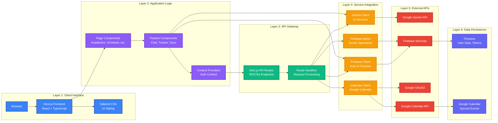

# CampusIQ - MPSTME: Architecture Diagram

## System Architecture

```mermaid
graph TB
    subgraph "Client Layer - Browser"
        Browser[Web Browser<br/>Chrome/Firefox/Edge]
    end
    
    subgraph "Presentation Layer - Next.js Frontend"
        subgraph "React Components"
            UI1[Login Page<br/>Auth UI]
            UI2[Dashboard<br/>Student/Faculty]
            UI3[Academics Page<br/>Exam Policy & Attendance]
            UI4[Schedule Page<br/>Timetable & Calendar]
            UI5[Navigation<br/>MainNav Component]
            UI6[Other Pages<br/>Campus/Resources/Community]
        end
        
        subgraph "Client-Side Libraries"
            AuthContext[Auth Context<br/>Firebase Auth State]
            FirestoreClient[Firestore Client SDK<br/>Real-time Data]
            Utils[Utility Functions<br/>Date-fns, CN Utils]
        end
    end
    
    subgraph "API Layer - Next.js API Routes"
        subgraph "Authentication APIs"
            API1[/api/auth/google<br/>OAuth Initiation]
            API2[/api/auth/google/callback<br/>Token Exchange]
        end
        
        subgraph "Calendar APIs"
            API3[/api/calendar/check<br/>Connection Status]
            API4[/api/calendar/sync<br/>Sync Timetable]
            API5[/api/calendar/events<br/>Fetch Events]
            API6[/api/calendar/delete-events<br/>Remove Events]
        end
    end
    
    subgraph "Service Layer - Client Libraries"
        subgraph "AI Services"
            GeminiClient[Gemini Client<br/>lib/gemini/client.ts<br/>Academic Intelligence Engine]
        end
        
        subgraph "Google Services"
            CalendarClient[Google Calendar Client<br/>lib/google-calendar/client.ts<br/>OAuth2 & Calendar Operations]
        end
        
        subgraph "Firebase Services"
            FirebaseConfig[Firebase Config<br/>lib/firebase/config.ts<br/>Auth & Firestore Init]
            FirebaseAdmin[Firebase Admin SDK<br/>Server-side Operations]
        end
    end
    
    subgraph "External Services - Google Cloud"
        subgraph "Google AI Platform"
            GeminiAPI[Google Gemini API<br/>Generative AI Models<br/>gemini-pro, gemini-1.5-pro]
        end
        
        subgraph "Google Workspace APIs"
            GoogleOAuth[Google OAuth2<br/>Authorization Server]
            CalendarAPI[Google Calendar API<br/>Calendar Management<br/>Event CRUD Operations]
        end
    end
    
    subgraph "Backend Services - Firebase"
        FirebaseAuth[Firebase Authentication<br/>Email/Password Auth<br/>Session Management]
        FirestoreDB[(Firestore Database<br/>NoSQL Document Store)]
    end
    
    subgraph "Data Storage"
        subgraph "Firestore Collections"
            UsersCol[(users/{userId}<br/>User Profiles)]
            TokensCol[(googleCalendarTokens/{userId}<br/>OAuth Tokens)]
            CommentsCol[(scheduleComments/{userId}<br/>Class Comments)]
            EventsCol[(events/{eventId}<br/>Campus Events)]
            NotesCol[(notes/{noteId}<br/>Student Notes)]
            AssignmentsCol[(assignments/{assignmentId}<br/>Assignments)]
        end
        
        GoogleCalendar[(Google Calendar<br/>User's Personal Calendar<br/>Synced Events)]
    end
    
    subgraph "Deployment - Vercel"
        Vercel[Vercel Platform<br/>Next.js Hosting<br/>Edge Functions]
    end
    
    %% Client to Presentation Layer
    Browser --> UI1
    Browser --> UI2
    Browser --> UI3
    Browser --> UI4
    Browser --> UI5
    Browser --> UI6
    
    %% Presentation to Client Libraries
    UI1 --> AuthContext
    UI2 --> AuthContext
    UI3 --> AuthContext
    UI4 --> AuthContext
    UI6 --> AuthContext
    
    UI3 --> FirestoreClient
    UI4 --> FirestoreClient
    UI6 --> FirestoreClient
    
    UI4 --> Utils
    UI3 --> Utils
    
    %% Presentation to API Layer
    UI4 --> API1
    UI4 --> API2
    UI4 --> API3
    UI4 --> API4
    UI4 --> API5
    UI4 --> API6
    
    %% API Layer to Service Layer
    API1 --> CalendarClient
    API2 --> CalendarClient
    API3 --> FirebaseAdmin
    API4 --> CalendarClient
    API4 --> FirebaseAdmin
    API5 --> CalendarClient
    API5 --> FirebaseAdmin
    API6 --> CalendarClient
    API6 --> FirebaseAdmin
    
    %% Service Layer to External Services
    GeminiClient --> GeminiAPI
    CalendarClient --> GoogleOAuth
    CalendarClient --> CalendarAPI
    FirebaseConfig --> FirebaseAuth
    FirebaseConfig --> FirestoreDB
    FirebaseAdmin --> FirestoreDB
    
    %% Client Libraries to External Services
    UI3 --> GeminiClient
    UI4 --> GeminiClient
    
    AuthContext --> FirebaseAuth
    FirestoreClient --> FirestoreDB
    
    %% External Services to Data Storage
    CalendarAPI --> GoogleCalendar
    
    %% Firebase to Data Storage
    FirestoreDB --> UsersCol
    FirestoreDB --> TokensCol
    FirestoreDB --> CommentsCol
    FirestoreDB --> EventsCol
    FirestoreDB --> NotesCol
    FirestoreDB --> AssignmentsCol
    
    %% Deployment
    Vercel --> Browser
    Vercel --> API1
    Vercel --> API2
    Vercel --> API3
    Vercel --> API4
    Vercel --> API5
    Vercel --> API6
    
    %% Styling
    classDef clientClass fill:#3B82F6,stroke:#1E40AF,stroke-width:2px,color:#fff
    classDef uiClass fill:#8B5CF6,stroke:#6D28D9,stroke-width:2px,color:#fff
    classDef apiClass fill:#10B981,stroke:#047857,stroke-width:2px,color:#fff
    classDef serviceClass fill:#F59E0B,stroke:#D97706,stroke-width:2px,color:#fff
    classDef googleClass fill:#EA4335,stroke:#B91C1C,stroke-width:2px,color:#fff
    classDef firebaseClass fill:#FFA000,stroke:#E65100,stroke-width:2px,color:#fff
    classDef dataClass fill:#6366F1,stroke:#4F46E5,stroke-width:2px,color:#fff
    classDef deployClass fill:#000000,stroke:#374151,stroke-width:2px,color:#fff
    
    class Browser clientClass
    class UI1,UI2,UI3,UI4,UI5,UI6,AuthContext,FirestoreClient,Utils uiClass
    class API1,API2,API3,API4,API5,API6 apiClass
    class GeminiClient,CalendarClient,FirebaseConfig,FirebaseAdmin serviceClass
    class GeminiAPI,GoogleOAuth,CalendarAPI googleClass
    class FirebaseAuth,FirestoreDB firebaseClass
    class UsersCol,TokensCol,CommentsCol,EventsCol,NotesCol,AssignmentsCol,GoogleCalendar dataClass
    class Vercel deployClass
```

## Alternative: Layered Architecture View



## Technology Stack Breakdown

### Frontend Technologies
- **Next.js 14**: React framework with App Router
- **TypeScript**: Type-safe JavaScript
- **Tailwind CSS**: Utility-first CSS framework
- **React Hooks**: State management and side effects
- **Date-fns**: Date manipulation library

### Backend Technologies
- **Next.js API Routes**: Serverless API endpoints
- **Firebase Authentication**: User authentication
- **Firebase Admin SDK**: Server-side Firestore operations
- **Firestore Client SDK**: Client-side database operations

### AI & Google Services
- **Google Gemini API**: Generative AI for chat interfaces
- **Google Calendar API**: Calendar event management
- **Google OAuth2**: Secure authorization flow

### Data Storage
- **Firestore**: NoSQL document database
  - User profiles
  - OAuth tokens
  - Schedule comments
  - Events, notes, assignments
- **Google Calendar**: User's personal calendar for synced events

### Deployment
- **Vercel**: Hosting platform for Next.js applications
- **Edge Functions**: Serverless function execution

## Data Flow Patterns

1. **Authentication Flow**: Browser → Firebase Auth → Firestore (user profile)
2. **AI Chat Flow**: UI Component → Gemini Client → Google Gemini API → Response
3. **Calendar Sync Flow**: UI → API Route → Calendar Client → Google OAuth → Google Calendar API → Firestore (tokens) → Google Calendar (events)
4. **Data Read Flow**: UI Component → Firestore Client → Firestore Database
5. **Data Write Flow**: UI Component → API Route → Firebase Admin → Firestore Database

## Security Features

- **Firebase Security Rules**: Row-level security for Firestore collections
- **OAuth2 Flow**: Secure token exchange for Google services
- **Protected Routes**: Client-side route protection with authentication checks
- **Environment Variables**: Secure storage of API keys and credentials
- **Token Management**: Secure storage and refresh of OAuth tokens
