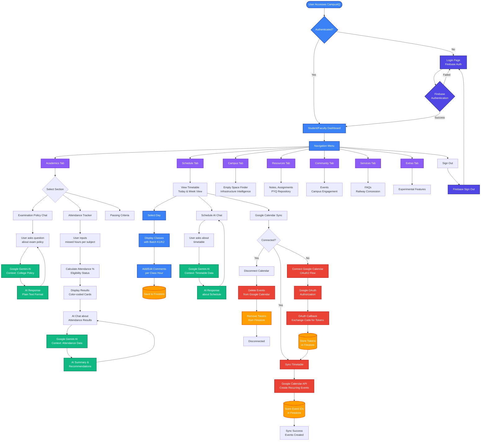
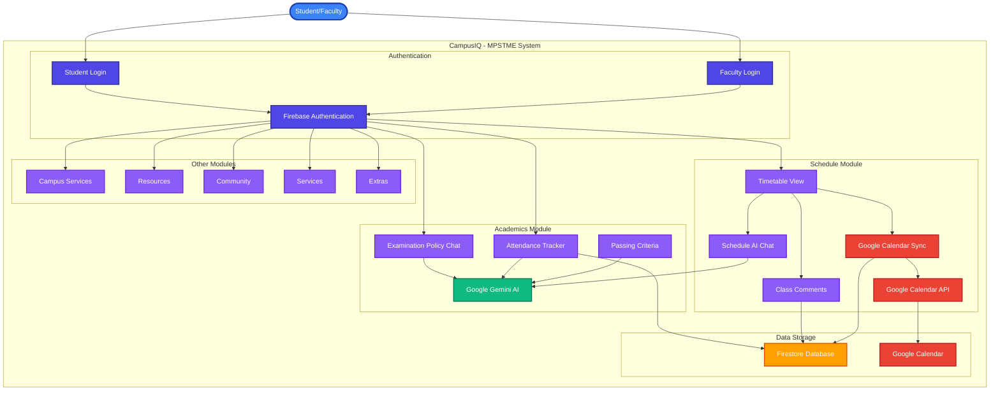

# CampusIQ - MPSTME: Process Flow Diagram

## Mermaid Diagram

## Alternative: Use Case Diagram

## Key Components

1. **Authentication Flow**: Firebase Auth handles user login/logout
2. **Academics Module**: 
   - Examination Policy Chat with Gemini AI
   - Attendance Tracker with calculations and AI chat
   - Passing Criteria explanation
3. **Schedule Module**:
   - Timetable display (Today & Week view)
   - Class comments (stored in Firestore)
   - Schedule AI Chat with Gemini AI
   - Google Calendar integration (OAuth, Sync, Unsync)
4. **Data Storage**: Firestore for user data, tokens, comments; Google Calendar for synced events
5. **AI Integration**: Google Gemini AI powers all chat interfaces with contextual knowledge
